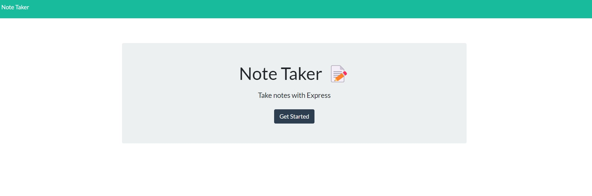
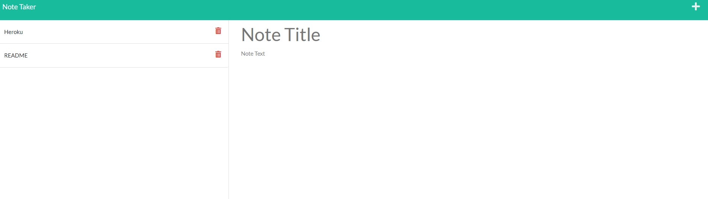
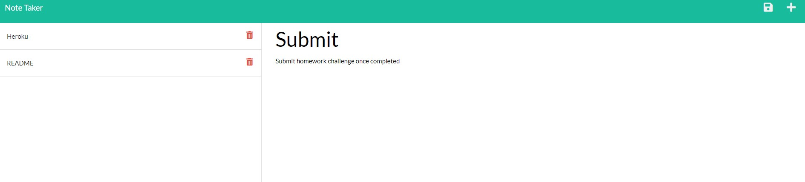

# Express Notes - Note Taker using Express
 

## Description
 
This project is a note taking page that will save new notes written by the user. The front end was given to me, I created the back end using javascript, node, and express. I learned how to create get and post routes to an existing front end to make it function properly. This is an interesting example of using proper routes in combination with node fs to update a backend json file while displaying the updated information on the front end as well.
 
 
## Link to Project
 
[Title Here](https://autumnlegere.github.io/ repo name here)
 
 
## Screenshot
 
Below are screenshots of the project

 
## Credits
 
- Completed note taker by another github user. I used the code for the app.delete route and app.get '/api/notes/:id'  
    - [github.com/lizaferguson/Express-Js-Note-Taker](https://github.com/lizaferguson/Express-Js-Note-Taker/blob/main/server.js)
